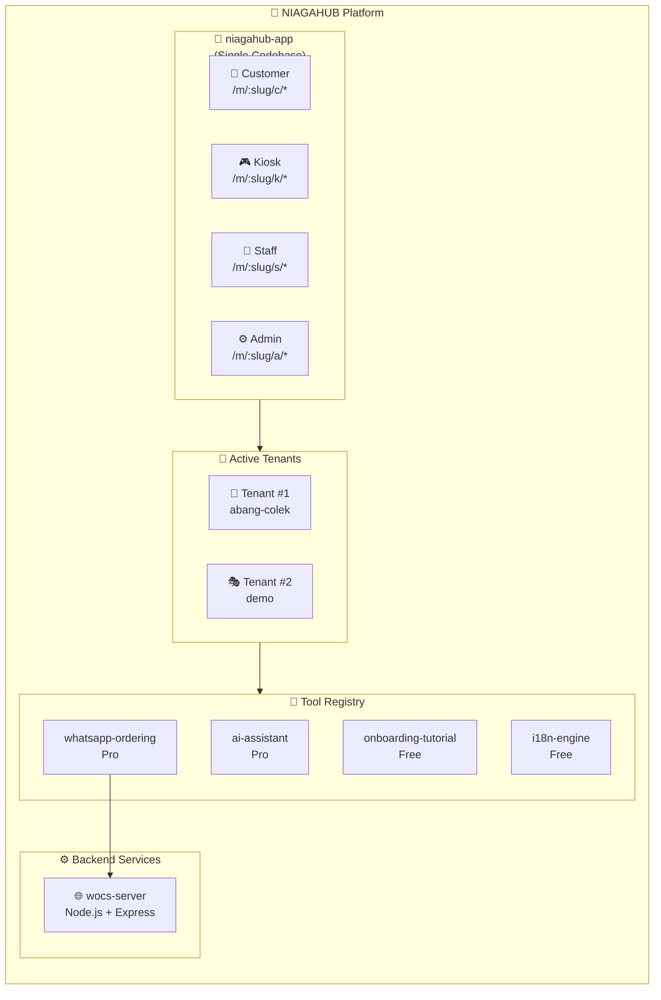
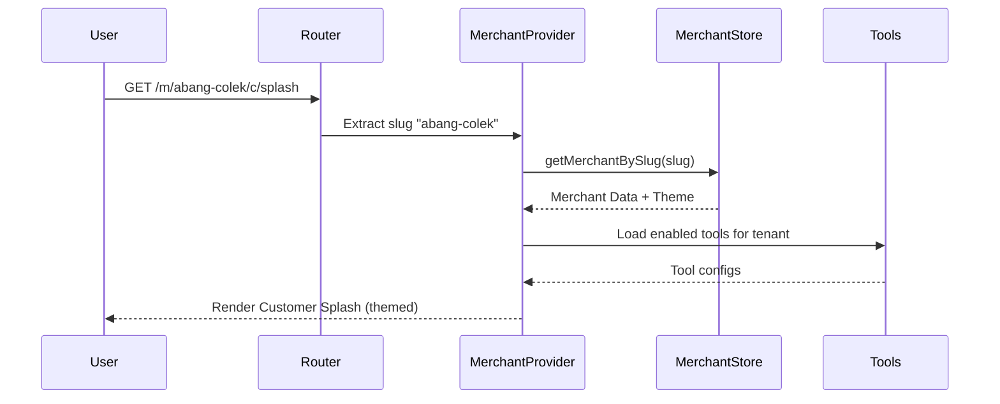
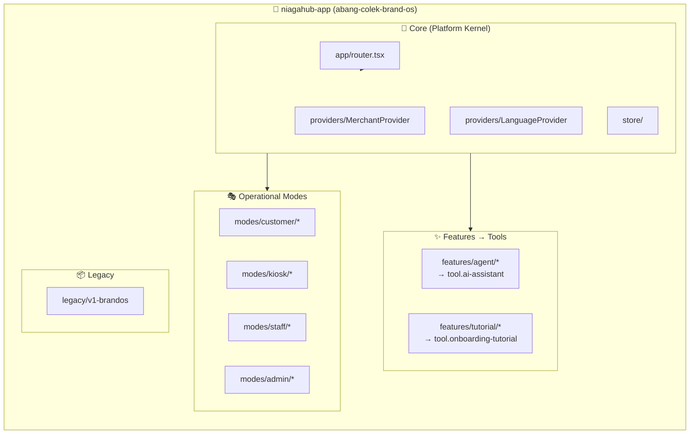
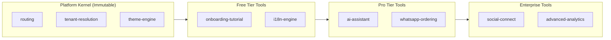

# NIAGAHUB Platform Architecture

> **Platform-First Architecture:** Single codebase, multi-tenant, tool-based modularity.

## Platform Overview



---

## Tenant Resolution Flow



---

## Single-App Mode Structure



---

## Supporting Projects

| Project | Type | Purpose | Status |
|---------|------|---------|--------|
| **abang-colek-brand-os** | Primary App | NIAGAHUB platform frontend | ✅ Active |
| **wocs-server** | Backend | WhatsApp Order Connector | ✅ Active |
| **abang-colek-wocs-extension** | Extension | Chrome WhatsApp integration | ✅ Active |
| **abang-colek-kiosk** | Legacy | Standalone kiosk (deprecated) | ⚠️ Migrate to mode |
| **abang-colek-mobile** | Legacy | Expo mobile app (deprecated) | ⚠️ Web-first strategy |

---

## Tool-Based Modularity



---

## Tech Stack

| Layer | Technology | Notes |
|-------|------------|-------|
| **Frontend** | React + Vite + TypeScript | Single-App Architecture |
| **Styling** | Tailwind CSS | Tenant-themed via CSS variables |
| **State** | Zustand | Namespaced per tenant |
| **Routing** | React Router v6 | `/m/:slug/:mode/*` pattern |
| **Backend** | Node.js + Express | WOCS server only |
| **Database** | Supabase | Multi-tenant with RLS (planned) |
| **AI** | Google Gemini API | Pro tier tool |

---

## File Structure (abang-colek-brand-os)

```
src/
├── app/          # Router, layouts
├── domain/       # Core data types
├── features/     # Tool implementations
├── modes/        # Customer, Kiosk, Staff, Admin
├── pages/        # Route components
├── providers/    # Context providers
├── store/        # Zustand stores
├── ui/           # Shared components
├── lib/          # Utilities
└── data/         # Seed data, configs

docs/
├── ROUTES.md         # Route map
├── TENANCY.md        # Multi-tenant guide
├── PLATFORM_CONSTITUTION.md  # Platform principles
└── TOOL_REGISTRY.md  # Tool catalog
```
