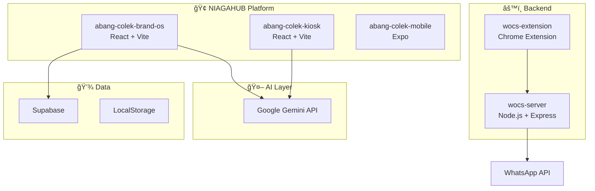

# 🏢 NIAGA-HUB-APPS

> **Multi-Project Monorepo** — A collection of AI-powered applications, tools, and experiments built with Google Gemini, React, and modern web technologies.

[](LICENSE)
[](CONTRIBUTING.md)

---

## 🌟 Overview

NIAGA-HUB-APPS is a **pnpm workspace monorepo** containing 40+ projects ranging from production-ready platforms to Gemini AI experiments. The flagship project is **NIAGAHUB Platform** — a multi-tenant F&B SaaS solution.

### 🎯 Core Platform

| Project | Description | Tech Stack |
|---------|-------------|------------|
| [abang-colek-brand-os](./abang-colek-brand-os) | **NIAGAHUB Platform** — Multi-tenant F&B ordering & queue management | React 19, Vite, Zustand, Gemini AI |
| [abang-colek-kiosk](./abang-colek-kiosk) | POS/Kiosk display interface with AI assistant | React, Vite, Gemini |
| [abang-colek-mobile](./abang-colek-mobile) | Mobile companion app | Expo, React Native |
| [wocs-server](./wocs-server) | WhatsApp Order Connector System backend | Node.js, Express, BullMQ |
| [abang-colek-wocs-extension](./abang-colek-wocs-extension) | Chrome extension for WhatsApp Web integration | Manifest V3, Vanilla JS |

### 🧪 Gemini AI Experiments

| Project | Description |
|---------|-------------|
| [infogenius](./infogenius) | AI-powered infographic generator with search grounding |
| [gemini-content-marketing-agent](./gemini-content-marketing-agent) | Content marketing automation agent |
| [function-call-kitchen](./function-call-kitchen) | Gemini function calling sandbox |
| [chat-with-docs](./chat-with-docs) | Document Q&A with Gemini |
| [chat-with-maps-live](./chat-with-maps-live) | Interactive maps with AI assistance |
| [visual-computer](./visual-computer) | Visual computing experiments |
| [gemini-os](./gemini-os) | Operating system-style AI interface |
| [thinking-space](./thinking-space) | Structured thinking with AI |
| [data-resolver](./data-resolver) | AI-powered data transformation |
| [proactive-co-creator](./proactive-co-creator) | Proactive AI assistant |

### 🎨 Creative Tools

| Project | Description |
|---------|-------------|
| [home-canvas](./home-canvas) | Interior design visualization |
| [product-mockup-visualization](./product-mockup-visualization) | Product mockup generator |
| [fit-check](./fit-check) | Fashion/outfit AI assistant |
| [veo-3-gallery](./veo-3-gallery) | Video generation gallery |
| [veo-cameos](./veo-cameos) | AI video cameos |
| [audio-avatars](./audio-avatars) | Audio-driven avatar generation |
| [enhance!](./enhance!) | Image enhancement tool |

### 📚 Educational & Utility

| Project | Description |
|---------|-------------|
| [flashcard-maker](./flashcard-maker) | AI flashcard generator |
| [video-to-learning-app](./video-to-learning-app) | Convert videos to learning content |
| [ask-the-manual](./ask-the-manual) | Manual/documentation Q&A |
| [research-visualization](./research-visualization) | Research data visualization |
| [link-2-ink](./link-2-ink) | URL to document converter |

### 🚀 Experimental

| Project | Description |
|---------|-------------|
| [startupos---integrated-operating-system](./startupos---integrated-operating-system) | Startup management OS |
| [action-replay](./action-replay) | Action recording & replay |
| [echopaths](./echopaths) | Audio path visualization |
| [kinetic-shapes](./kinetic-shapes) | Interactive shape animations |
| [sky-metropolis](./sky-metropolis) | 3D city visualization |
| [spinnerevolve](./spinnerevolve) | Loading animation library |
| [synergy-intro](./synergy-intro) | Team intro generator |
| [robotics-spatial-understanding](./robotics-spatial-understanding) | Robotics spatial AI |
| [mcp-maps-3d](./mcp-maps-3d) | 3D maps with MCP |
| [native-audio-function-call-sandbox](./native-audio-function-call-sandbox) | Audio function calling |
| [flash-ui](./flash-ui) | Rapid UI prototyping |

---

## 🚀 Quick Start

### Prerequisites

- **Node.js** >= 18.0.0
- **pnpm** >= 8.0.0 (recommended)
- **Git**

### Installation

```bash
# Clone the repository
git clone https://github.com/thisisniagahub/NIAGA-HUB-APPS.git
cd NIAGA-HUB-APPS

# Install dependencies
pnpm install

# Or install for a specific project
cd abang-colek-brand-os
pnpm install
```

### Running Projects

```bash
# Run the main NIAGAHUB Platform
cd abang-colek-brand-os
pnpm dev

# Run the kiosk interface
cd abang-colek-kiosk
pnpm dev

# Run the backend server
cd wocs-server
pnpm dev
```

### Environment Variables

Most projects require a `.env` or `.env.local` file:

```env
# For Gemini AI projects
VITE_GEMINI_API_KEY=your_gemini_api_key

# For Supabase projects
VITE_SUPABASE_URL=your_supabase_url
VITE_SUPABASE_ANON_KEY=your_supabase_anon_key
```

---

## 📁 Repository Structure

```
NIAGA-HUB-APPS/
│
├── 🏪 CORE PLATFORM
│   ├── abang-colek-brand-os/          # NIAGAHUB Platform - Multi-tenant F&B SaaS
│   ├── abang-colek-kiosk/             # Kiosk/POS display interface
│   ├── abang-colek-mobile/            # Mobile companion app (Expo)
│   ├── wocs-server/                   # WhatsApp Order Connector backend
│   └── abang-colek-wocs-extension/    # Chrome extension for WhatsApp Web
│
├── 🤖 GEMINI AI EXPERIMENTS
│   ├── infogenius/                    # AI infographic generator
│   ├── gemini-content-marketing-agent/ # Content marketing automation
│   ├── gemini-os/                     # OS-style AI interface
│   ├── function-call-kitchen/         # Function calling sandbox
│   ├── chat-with-docs/                # Document Q&A
│   ├── chat-with-maps-live/           # Interactive maps with AI
│   ├── data-resolver/                 # AI data transformation
│   ├── proactive-co-creator/          # Proactive AI assistant
│   ├── thinking-space/                # Structured thinking with AI
│   ├── visual-computer/               # Visual computing experiments
│   ├── ask-the-manual/                # Manual/documentation Q&A
│   └── native-audio-function-call-sandbox/ # Audio function calling
│
├── 🎨 CREATIVE TOOLS
│   ├── home-canvas/                   # Interior design visualization
│   ├── product-mockup-visualization/  # Product mockup generator
│   ├── fit-check/                     # Fashion/outfit AI assistant
│   ├── veo-3-gallery/                 # Video generation gallery
│   ├── veo-cameos/                    # AI video cameos
│   ├── audio-avatars/                 # Audio-driven avatars
│   ├── enhance!/                      # Image enhancement tool
│   ├── link-2-ink/                    # URL to document converter
│   └── flash-ui/                      # Rapid UI prototyping
│
├── 📚 EDUCATIONAL & UTILITY
│   ├── flashcard-maker/               # AI flashcard generator
│   ├── video-to-learning-app/         # Video to learning content
│   ├── research-visualization/        # Research data visualization
│   └── niaga-hub_bring-any-idea-to-life/ # Idea-to-prototype tool
│
├── 🚀 EXPERIMENTAL
│   ├── startupos---integrated-operating-system/ # Startup management OS
│   ├── action-replay/                 # Action recording & replay
│   ├── echopaths/                     # Audio path visualization
│   ├── kinetic-shapes/                # Interactive shape animations
│   ├── sky-metropolis/                # 3D city visualization
│   ├── spinnerevolve/                 # Loading animation library
│   ├── synergy-intro/                 # Team intro generator
│   ├── robotics-spatial-understanding/ # Robotics spatial AI
│   ├── mcp-maps-3d/                   # 3D maps with MCP
│   └── sample-image/                  # Image sample utilities
│
├── 📂 OTHER
│   └── WAWCD/                         # WhatsApp Web utilities
│
├── 📄 ROOT FILES
│   ├── README.md                      # This file
│   ├── ARCHITECTURE_DIAGRAM.md        # System architecture
│   ├── PROJECT_REVIEW.md              # Comprehensive project review
│   ├── REPOS.md                       # Repository documentation
│   ├── package.json                   # Root package config
│   ├── pnpm-workspace.yaml            # Workspace configuration
│   └── metadata.json                  # Monorepo metadata
│
└── � Total: 44 projects
```

---

## 🏗️ Architecture



---

## 📖 Documentation

| Document | Description |
|----------|-------------|
| [ARCHITECTURE_DIAGRAM.md](./ARCHITECTURE_DIAGRAM.md) | Visual system architecture |
| [PROJECT_REVIEW.md](./PROJECT_REVIEW.md) | Comprehensive project review |
| [abang-colek-brand-os/PRD.md](./abang-colek-brand-os/PRD.md) | Product Requirements Document |
| [abang-colek-brand-os/docs/](./abang-colek-brand-os/docs/) | Platform documentation |

---

## 🛠️ Tech Stack

| Category | Technologies |
|----------|-------------|
| **Frontend** | React 19, Vite, TypeScript, Tailwind CSS |
| **State Management** | Zustand |
| **Mobile** | Expo, React Native |
| **Backend** | Node.js, Express, BullMQ |
| **Database** | Supabase, PostgreSQL |
| **AI** | Google Gemini API |
| **Testing** | Vitest, Playwright |
| **Package Manager** | pnpm (workspaces) |

---

## 🤝 Contributing

We welcome contributions! Please see our [Contributing Guide](CONTRIBUTING.md) for details.

1. Fork the repository
2. Create your feature branch (`git checkout -b feature/amazing-feature`)
3. Commit your changes (`git commit -m 'feat: add amazing feature'`)
4. Push to the branch (`git push origin feature/amazing-feature`)
5. Open a Pull Request

---

## 📄 License

This project is licensed under the MIT License - see the [LICENSE](LICENSE) file for details.

---

## 👥 Team

Built with ❤️ by **NIAGAHUB Team**

- 🌐 Website: [niagahub.com](https://niagahub.com)
- 📧 Contact: <hello@niagahub.com>

---

## ⭐ Star History

If you find this project useful, please consider giving it a ⭐!

---

*Last updated: 2026-01-18*
