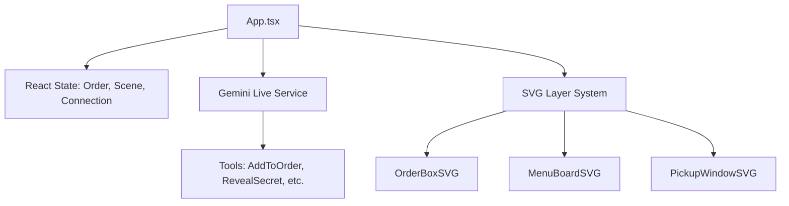

# Architecture: Abang Colek Kiosk

This document outlines the technical structure of the application.

## 1. High-Level Component Structure

## 2. The Audio Pipeline
The application implements a custom audio processing loop to handle the raw PCM data required by Gemini Live.

- **Input (Mic)**: 
    - `getUserMedia` -> `AudioContext` (16kHz).
    - `ScriptProcessorNode` chunks audio data into Base64-encoded PCM.
    - Sent via `session.sendRealtimeInput`.
- **Output (Model)**:
    - Raw PCM chunks received via `onmessage`.
    - Queued using a `nextStartTime` cursor to ensure gapless playback.
    - Routed through a `GainNode` and `AnalyserNode` for volume visualization.

## 3. Visual Layering System
To maintain performance on mobile, the UI is split into **Static**, **Reactive**, and **Generative** layers:
- **Static**: SVG backgrounds (poles, bricks) rendered once.
- **Reactive**: CRT text and volume glow updated via React state/RAF.
- **Generative**: Injected SVG strings (Ingredients) and Dynamic `<image>` tags (Order Preview).

## 4. State Management
- **Order State**: Managed in `orderItems` array. Ref-synced for access within async tool-call callbacks.
- **Scene State**: Simple enum (`order` | `pickup`) driving a `translateX` transition on the main scene track.
- **Glitch Mode**: A CSS-class-based toggle that applies filters and keyframe animations globally.